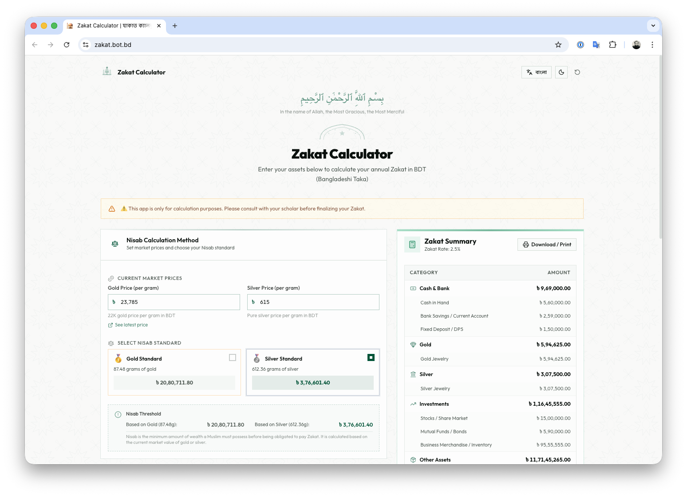

# 🕌 Zakat Calculator | যাকাত ক্যালকুলেটর

A modern, bilingual (English & বাংলা) Zakat calculator built for Bangladeshi Muslims. Calculate your annual Zakat obligations accurately in BDT (Bangladeshi Taka) with an intuitive, mobile-friendly interface.



> **⚠️ Disclaimer:** This app is only for calculation purposes. Please consult with your scholar before finalizing your Zakat.

## ✨ Features

- **Bilingual** — Full support for English and বাংলা (Bengali)
- **Comprehensive asset categories** — Cash & bank, gold, silver, investments, other assets, and liabilities
- **Nisab calculation** — Choose between gold standard (87.48g) or silver standard (612.36g)
- **Real-time calculation** — Zakat summary updates instantly as you enter your assets
- **Dark mode** — Light and dark theme support
- **Print / PDF** — Generate a printable Zakat report
- **Responsive** — Works on mobile, tablet, and desktop
- **Offline-capable** — Runs entirely in the browser with no server dependency
- **Latest gold price** — Quick link to [BAJUS gold price](https://www.bajus.org/gold-price) for up-to-date market rates

## 🧮 How It Works

1. **Set market prices** — Enter the current per-gram price of gold (22K) and silver
2. **Choose Nisab method** — Select gold or silver standard for the Nisab threshold
3. **Enter your assets** — Add items across six categories: cash, gold, silver, investments, other assets, and liabilities
4. **View your Zakat** — The summary panel shows your total assets, net zakatable wealth, Nisab status, and the Zakat payable (2.5%)

### Zakat Formula

```
Net Zakatable Assets = Total Assets − Total Liabilities
Zakat Payable = Net Zakatable Assets × 2.5%  (if assets ≥ Nisab)
```

### Nisab Thresholds

| Standard | Weight          | Description                        |
| -------- | --------------- | ---------------------------------- |
| Gold     | 87.48g (7.5 tola)   | Based on 22K gold market price |
| Silver   | 612.36g (52.5 tola) | Based on pure silver market price |

## 🚀 Getting Started

### Prerequisites

- [Node.js](https://nodejs.org/) (v20 or later)
- npm

### Installation

```bash
git clone https://github.com/AminulBD/zakat.bot.bd.git
cd zakat.bot.bd
npm install
```

### Development

```bash
npm run dev
```

Open [http://localhost:5173](http://localhost:5173) in your browser.

### Build

```bash
npm run build
```

The production build will be output to the `dist/` directory.

### Preview Production Build

```bash
npm run preview
```

## 🛠️ Tech Stack

| Category       | Technology                                                        |
| -------------- | ----------------------------------------------------------------- |
| Framework      | [React 19](https://react.dev/)                                    |
| Language       | [TypeScript](https://www.typescriptlang.org/)                     |
| Build Tool     | [Vite 7](https://vite.dev/)                                       |
| Routing        | [TanStack Router](https://tanstack.com/router)                    |
| Styling        | [Tailwind CSS 4](https://tailwindcss.com/)                        |
| UI Components  | [shadcn/ui](https://ui.shadcn.com/) + [Radix UI](https://radix-ui.com/) |
| Icons          | [Lucide React](https://lucide.dev/)                               |
| Fonts          | [Outfit](https://fonts.google.com/specimen/Outfit), [Noto Sans Bengali](https://fonts.google.com/noto/specimen/Noto+Sans+Bengali) |

## 🌐 Deployment

This project includes a GitHub Actions workflow that automatically builds and deploys to **GitHub Pages** on every push to `main`.

### Setup

1. Go to your repository **Settings → Pages**
2. Under **Source**, select **GitHub Actions**
3. Push to `main` — the workflow will build and deploy automatically

### Custom Domain

If you're using a custom domain (e.g. `zakat.bot.bd`):

1. Add a `CNAME` file in the `public/` directory with your domain:
   ```
   zakat.bot.bd
   ```
2. Remove or set `VITE_BASE_PATH` to `/` in `.github/workflows/deploy.yml`
3. Configure your domain's DNS to point to GitHub Pages ([docs](https://docs.github.com/en/pages/configuring-a-custom-domain-for-your-github-pages-site))

## 📁 Project Structure

```
src/
├── components/
│   ├── ui/                  # shadcn/ui base components
│   └── zakat/
│       ├── asset-categories.tsx   # Cash, gold, silver, investment, other, liability forms
│       ├── currency-input.tsx     # BDT currency & weight input component
│       ├── islamic-pattern.tsx    # Decorative Islamic UI elements
│       ├── nisab-settings.tsx     # Gold/silver price & Nisab method selector
│       ├── zakat-calculator.tsx   # Main calculator page layout
│       └── zakat-summary.tsx      # Zakat result summary & print report
├── lib/
│   ├── i18n.tsx             # Bilingual translations (en/bn)
│   ├── theme.tsx            # Dark/light theme provider
│   ├── utils.ts             # Utility functions
│   └── zakat.ts             # Core Zakat calculation logic & constants
├── routes/
│   ├── __root.tsx           # Root layout
│   └── index.tsx            # Home page
├── index.css                # Global styles
└── main.tsx                 # App entry point
```

## 🤲 Contributing

Contributions are welcome! If you'd like to improve the calculator, fix a bug, or add a feature:

1. Fork the repository
2. Create a feature branch (`git checkout -b feature/my-feature`)
3. Commit your changes (`git commit -m 'Add my feature'`)
4. Push to the branch (`git push origin feature/my-feature`)
5. Open a Pull Request

## 📜 License

This project is open source and available under the [MIT License](LICENSE).

---

<p align="center">
  <em>"Take from their wealth a charity to purify them and cause them increase."</em><br/>
  <small>— Surah At-Tawbah (9:103)</small>
</p>